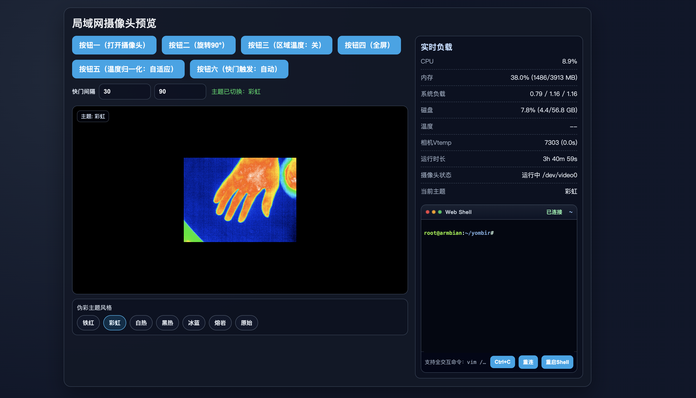

# Yombir（Tiny1B / CT256 热成像）

这是一个面向 Tiny1B/CT256（256×192）等 UVC 热成像模组的本地预览/录制工具：

- **C++ 应用**：编译得到 `yombir`，可全屏预览与录制 `.t16` 原始帧，并支持无桌面环境的 5 秒 MP4 录制。
- **局域网网页预览（推荐上板子）**：`webcam_server` 提供轻量后端（读取 `/dev/video*`，支持 HTTP 原始帧与 WebSocket 二进制流），配合 Nginx 托管网页可在手机/电脑上低延迟预览。

本文重点：教你在 **泰山派（ARM Linux）** 上 **编译 yombir**，并 **安装 Nginx** 让网页能“点按钮打开摄像头”驱动 Tiny1B/CT256。

> 说明：网页后端的解码逻辑与 yombir 的格式假设保持一致，但网页预览本身不依赖 yombir 可执行文件。

## 1. 硬件与系统要求

- 泰山派（ARM64/ARMv8）任意常见 Linux 发行版（Ubuntu/Debian/openEuler 等均可）
- Tiny1B/CT256 模组（或同协议相机），插上后应出现 `/dev/video*`
- 建议接显示器/桌面环境做一次本地验证；若无桌面环境，也可以使用 yombir 的 `--headless-5s` 先验证采集链路

## 2. 依赖安装（泰山派）

### 2.1 Debian/Ubuntu（apt）

```bash
sudo apt update
sudo apt install -y \
  build-essential cmake pkg-config \
  libv4l-dev v4l-utils \
  libopencv-dev \
  ffmpeg \
  python3 \
  nginx

# 可选：提升网页后端的调色板/归一化性能
sudo apt install -y python3-numpy
```

### 2.2 openEuler / CentOS（dnf/yum）

不同发行版包名可能略有差异，核心是：`cmake`、`gcc/g++`、OpenCV 开发包、`v4l-utils`、`ffmpeg`、`python3`、`nginx`。

## 3. 识别摄像头设备节点

插上 Tiny1B/CT256 后，在泰山派上执行：

```bash
v4l2-ctl --list-devices
ls -l /dev/video*
```

如果机器上有多个 `/dev/videoX`，可以进一步查看某个节点是否具备采集能力：

```bash
v4l2-ctl -D -d /dev/video0
v4l2-ctl -D -d /dev/video1
```

网页后端会自动选择 **第一个**具备 `Video Capture` 能力的设备节点。

## 4. 编译 yombir（C++）

在仓库根目录：

```bash
cmake -S . -B build
cmake --build build -j"$(nproc)"
```

编译产物在 `build/yombir`。

## 5. 本地验证（推荐先做一次）

### 5.1 无桌面环境：录 5 秒 MP4

在仓库根目录运行（示例用 `/dev/video0`，按实际替换）：

```bash
sudo ./yombir.sh /dev/video0 --headless-5s
```

它会在你执行命令的当前目录生成 5 秒 MP4（并自动转码为更通用的 H.264 / `yuv420p`）。

如果报错 “打不开设备/权限不足”，先看本文末尾“常见问题”。

### 5.2 桌面环境：全屏预览

```bash
./yombir.sh /dev/video0
```

按键：

- `Space` 退出
- `Enter` 开始/停止录制（录制为 `.t16`，保存在 `captures/`）
- `R` 切换旋转（或启动参数 `r` / `r9`）

## 6. 网页驱动与局域网预览（Nginx + Python 后端）

### 6.1 启动后端（本地监听 18080）

后端程序为 `webcam_server/camera_backend.py`，默认只监听本机：

```bash
python3 webcam_server/camera_backend.py --host 127.0.0.1 --port 18080
```

它依赖：

- `ffmpeg`：从 `/dev/video*` 读取 `yuyv422` 原始帧
- `v4l2-ctl`：枚举并判断 `Video Capture` 能力
- （可选）`python3-numpy`：加速调色板转换

接口简表（用于排错）：

- `POST /api/open-camera`：自动查找并启动采集
- `POST /api/stop-camera`：停止采集
- `GET /frame.raw`：HTTP 长轮询取帧（支持 `after`、`timeout_ms`），返回 `gray16le`（256×192×2 bytes）
- `GET /ws/raw`：WebSocket 二进制持续流（前端主链路）
- `GET /api/status`、`GET /api/metrics`

说明：

- Web 预览默认优先使用 `WebSocket /ws/raw`，失败时自动回退到 `GET /frame.raw`。
- 后端内部使用 3 帧小环形队列（追赶最新帧，降低瞬时抖动影响）。
- 前端默认使用 `OffscreenCanvas + Worker` 做伪彩渲染，浏览器不支持时自动回退主线程渲染。

### 6.2 Nginx 配置：托管网页 + 反代后端

网页静态文件在 `webcam_server/public/`（入口 `index.html`）。推荐把仓库放到固定目录（示例：`/opt/yombir`）：

```bash
sudo mkdir -p /opt
sudo cp -a . /opt/yombir
```

创建 Nginx 站点配置（二选一放置路径，按你的发行版习惯）：

- `/etc/nginx/conf.d/yombir.conf`（常见于 CentOS/openEuler）
- `/etc/nginx/sites-available/yombir` + 建立软链到 `sites-enabled`（常见于 Debian/Ubuntu）

配置内容示例（把 `/opt/yombir` 按实际修改）：

```nginx
server {
	listen 80;
	server_name _;

	root /opt/yombir/webcam_server/public;
	index index.html;

	# 静态页面（单页应用写法：不存在的路径回落到 index.html）
	location / {
		try_files $uri $uri/ /index.html;
	}

	# 反代后端 API
	location /api/ {
		proxy_pass http://127.0.0.1:18080;
		proxy_http_version 1.1;
		proxy_set_header Host $host;
		proxy_set_header X-Real-IP $remote_addr;
		proxy_set_header X-Forwarded-For $proxy_add_x_forwarded_for;
		proxy_buffering off;
	}

	# WebSocket 原始帧流（新版主链路）
	location /ws/ {
		proxy_pass http://127.0.0.1:18080;
		proxy_http_version 1.1;
		proxy_set_header Upgrade $http_upgrade;
		proxy_set_header Connection "Upgrade";
		proxy_set_header Host $host;
		proxy_buffering off;
		proxy_request_buffering off;
		proxy_read_timeout 3600s;
	}

	# HTTP 取帧与兼容流接口（回退链路）
	location = /frame.raw {
		proxy_pass http://127.0.0.1:18080;
		proxy_http_version 1.1;
		proxy_set_header Host $host;
		proxy_set_header Connection "";
		proxy_buffering off;
		proxy_request_buffering off;
	}
	location = /frame.jpg {
		proxy_pass http://127.0.0.1:18080;
		proxy_http_version 1.1;
		proxy_set_header Host $host;
		proxy_set_header Connection "";
		proxy_buffering off;
		proxy_request_buffering off;
	}
	location = /stream.mjpg {
		proxy_pass http://127.0.0.1:18080;
		proxy_http_version 1.1;
		proxy_set_header Host $host;
		proxy_set_header Connection "";
		proxy_buffering off;
		proxy_request_buffering off;
	}
}
```

检查并重载 Nginx：

```bash
sudo nginx -t
sudo systemctl reload nginx
```

现在在同一局域网下，用浏览器打开：

```text
http://<泰山派IP>/
```

点击“按钮一（打开摄像头）”即可开始预览。

### 6.3（可选）systemd：开机自启后端

后端是纯 Python 脚本，推荐用 systemd 托管。创建：`/etc/systemd/system/yombir-webcam.service`

```ini
[Unit]
Description=Yombir Tiny1B LAN webcam backend
After=network.target

[Service]
Type=simple
WorkingDirectory=/opt/yombir
ExecStart=/usr/bin/python3 /opt/yombir/webcam_server/camera_backend.py --host 127.0.0.1 --port 18080
Restart=on-failure
RestartSec=1

# 若需要读取 /dev/video* 与 /dev/bus/usb（用于 vtemp 指标），权限可能要求更高。
# 最省事方案：先用 root 跑通；再按“常见问题”添加 udev/组权限。
User=root

[Install]
WantedBy=multi-user.target
```

启用并查看日志：

```bash
sudo systemctl daemon-reload
sudo systemctl enable --now yombir-webcam
sudo journalctl -u yombir-webcam -f
```

### 6.4（可选）泰山派 WiFi 连接状态指示灯（RGB）

仓库提供了一个小守护程序：根据当前连接的 WiFi SSID 控制泰山派 RGB 灯常亮/闪烁：

- 连接到 `CVPU`：蓝灯常亮
- 连接到 `losehu`：红灯常亮
- 连接到其它 WiFi：绿灯常亮
- 未连接 WiFi：红→绿→蓝 依次亮一下（循环）

脚本在：`utils/taishanpi_wifi_led.py`，systemd 单元模板在：`utils/taishanpi-wifi-led.service`。

安装启用：

```bash
sudo install -m 0755 utils/taishanpi_wifi_led.py /opt/yombir/utils/taishanpi_wifi_led.py
sudo cp -futils/taishanpi-wifi-led.service /etc/systemd/system/taishanpi-wifi-led.service

sudo systemctl daemon-reload
sudo systemctl enable --now taishanpi-wifi-led
sudo journalctl -u taishanpi-wifi-led -f
```

如需改 SSID 或 LED 名称（不同系统可能不是 `rgb-led-r/g/b`），编辑 `/etc/systemd/system/taishanpi-wifi-led.service` 的 `ExecStart`，或直接运行：

```bash
sudo /usr/bin/python3 -u /opt/yombir/utils/taishanpi_wifi_led.py \
	--ssid-blue CVPU --ssid-red losehu \
	--led-r rgb-led-r --led-g rgb-led-g --led-b rgb-led-b
```

## 7. 常见问题（泰山派上最常见）

### 7.1 权限不足：打不开 /dev/videoX

把当前用户加入 `video` 组（然后重新登录一次）：

```bash
sudo usermod -aG video "$USER"
```

或先用 `sudo` 运行验证。

### 7.2 指标里“相机Vtemp读取失败”

网页后端会尝试调用 `utils/tiny1b_uvc_cmd.py` 直接读 USB 控制传输（访问 `/dev/bus/usb/BBB/DDD`）。

- 没权限：常见表现为 `Permission denied`。
  - 最简单：让后端以 root 运行（上面的 systemd 示例已用 `User=root`）。
  - 更规范：为该 USB VID/PID 添加 udev 规则放权（不同型号 VID/PID 不同，需自行确认）。
- 不想要该指标：可以忽略，它不影响视频预览。

### 7.3 网页提示“未找到或无法打开摄像头”

先确认：

```bash
which ffmpeg
which v4l2-ctl
v4l2-ctl --list-devices
```

若机器上有多路摄像头，网页后端会选到“第一个 Video Capture”，建议临时拔掉其他摄像头/采集卡再试。

### 7.4 画面有延迟/卡顿

- 确认后端与 Nginx 在同机（`proxy_buffering off`，且 `/ws/` 已配置 `Upgrade` 透传）
- 安装 `python3-numpy` 可降低 CPU 占用
- Wi‑Fi 质量差时，建议有线或把泰山派作为 AP/路由旁边
- 若浏览器不支持 `OffscreenCanvas`，会自动回退主线程渲染，弱设备上可能更易掉帧
- 若确实有瞬时掉帧：当前策略是“低延迟优先”，会自动追到最新帧（不保证逐帧不丢）

## 8. 其它文档

- `.t16` 转 MP4：见 [utils/README.md](./utils/README.md)
- 调色板/渐变：见 [gradients/README.md](./gradients/README.md)
- ARM 上的 Tiny1B UVC 扩展命令工具：`utils/tiny1b_uvc_cmd.py`，以及说明 [utils/ARM_UVC_EXT_CMD.md](./utils/ARM_UVC_EXT_CMD.md)

## License

GPL-2.0

## Acknowledgements

- eevblog.com 论坛对视频格式逆向的资料
- `lib/libv4l2cpp`（public domain）
